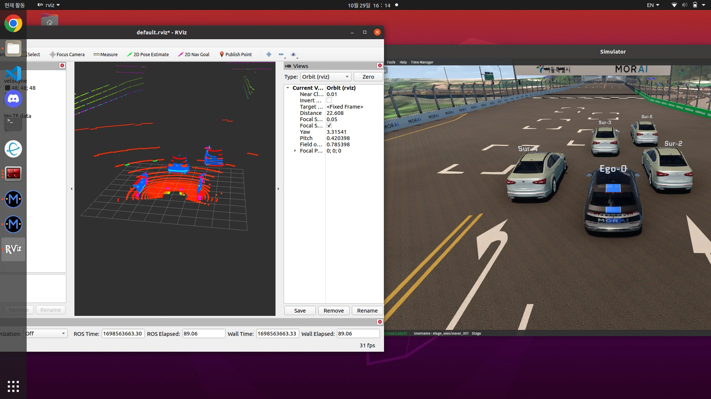
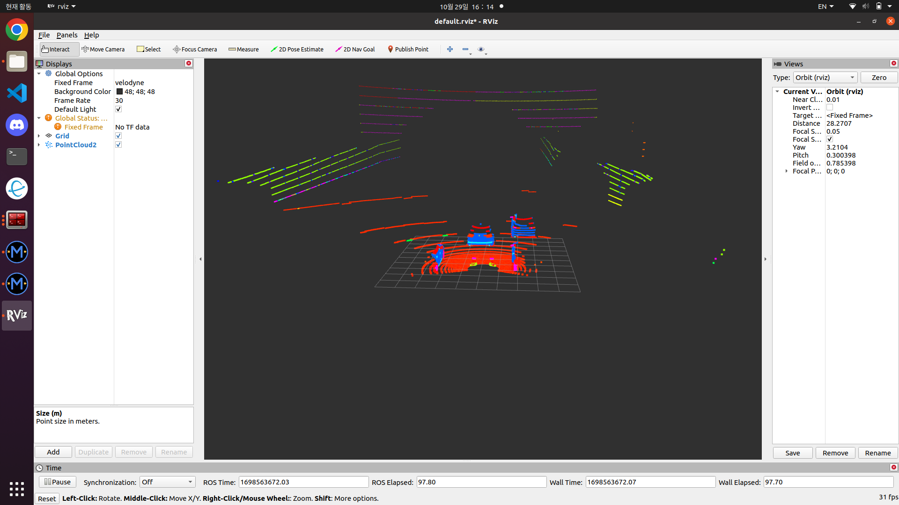
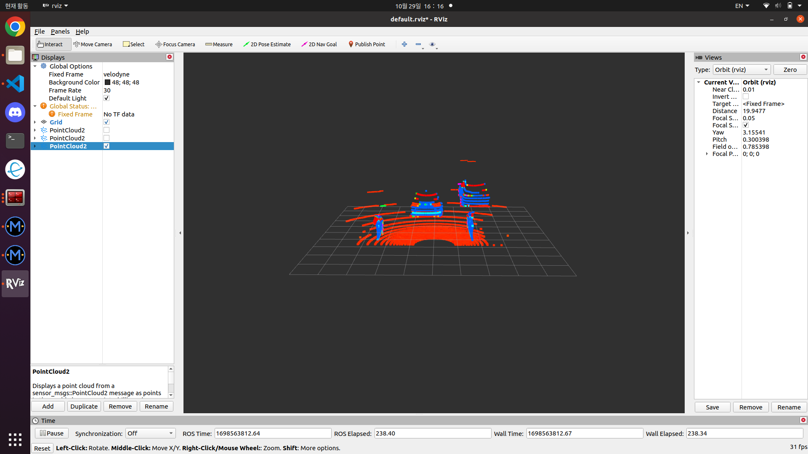

# Velodyne_3D_LiDAR

자율주행을 위한 3D LiDAR 사용 방법 및 진행 과정이다.

아래 블로그에 각 과정에 대한 자세한 설명을 적어놓았다.
(나중에 블로그 주소 첨부)

- Velodyne VLP-16 3D LiDAR를 사용
- MORAI 시뮬레이션 환경에서 진행

## 1. Raw Data 받기

Velodyne Driver의 launch파일을 통해서 original raw data를 받아온다.

차량과 장애물 차량의 위치는 고정되어있다.

MORAI를 제외한 Rviz만 띄운 사진.

## 2. ROI (Region of Interst)

LiDAR로 들어온 Raw Data중에서 필요한 부분만 볼 수 있도록 설정한다.

필요 이상으로 보게 되면 연산량이 많아져 속도가 느려지기 때문이다.

예를 들어 위에 사진에서 보면 터널 천장까지 나오는데, 이는 불필요한 data이다.

따라서 보고싶은 부분만 관심영역으로 설정해서 계산량을 확 줄일 수 있다.

ROI를 통해 멀리있는 벽면과 터널을 없앴다.

## 3. Voxel (Volume + Pixel)

ROI로 자른 data도 바로 사용할 수 없다.

마찬가지로 필요 이상으로 많은 data가 들어오고 이를 바로 사용한다면 연산 속도가 오래 걸린다.

이것을 해결하기 위해서 down sampling인 Voxel을 수행한다.

Voxel은 설정한 크기의 3D cube안에 하나의 PointCloud만 존재하게 해주는 작업이다.

voxel하기 전 ROI 사진

voxel한 이후의 사진

(실행할때 순서가 잘못되어 ROI 이전에 Voxel을 진행했다.)

## 4. Outlier 제거

Outlier를 이용하여 Noise를 제거한다.

Outlier에는 statical outlier removal과 raius outlier removal가 있다.

위 코드에선 statical outlier removal를 이용하고 있다.

위에 ROI 사진과 비교하였을 때 멀리 떨어져있는 Noise를 효과적으로 제거할 수 있다.

## 5. RANdom SAmple Consensus (RANSAC)

RANSAC 알고리즘을 이용하여 지면을 제거할 수 있다.

RANSAC은 임의의 3점을 잡아 평면을 만들고, 해당 평면에 설정한 threshold이내에 점이 몇개 있는지 파악한다.

이를 설정한 반복횟수만큼 진행하여 가장 많은 점을 가지고 있는 최적의 평면을 찾게 된다.

이를 제거하는 것이 RANSAC 알고리즘이다.

지면에 가장 많은 점들이 분포하기 때문에 지면에 해당하는 평면을 찾아제거하면 된다.

가장 많은 점인 빨간 점 지면이 효과적으로 없어진 것을 확인할 수 있다.

## 6. DBSCAN (Density-based spatial clustering of applications with noise)

여기까지 진행해서 나온 PointCloud들은 객체로서의 가치가 있는 point들이다.

Dbscan을 이용해서 해당 점들을 하나의 군집(clustering)으로 만드는 과정을 진행한다.

특정 distance이내에 m개의 점 이상이 속해있으면 하나의 군집으로 보고 core point, border point, noise point를 설정한다.

같은 색으로 같은 군집을 표현했다.

이처럼 같은 군집에 대해서 bounding box를 설정했다.

mlpack의 dbscan을 사용했다.
Dbscan은 mlpack c++ 설치후 사용 가능하다.
(https://www.mlpack.org/)

- 참고자료
  - https://gaussian37.github.io/autodrive-lidar-intro/
